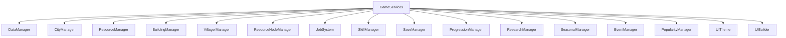
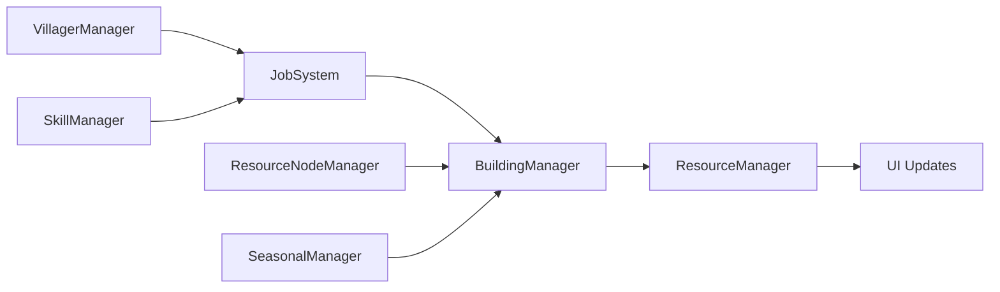
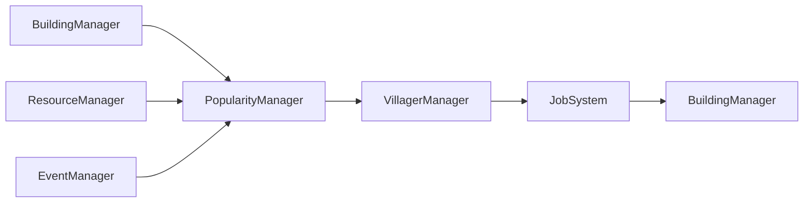
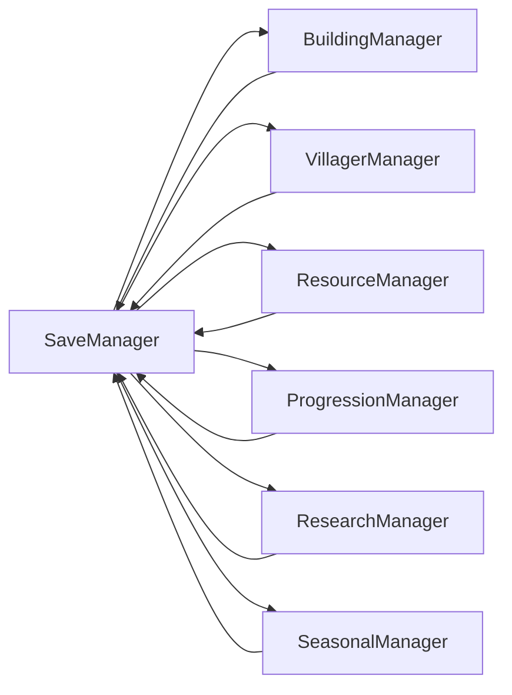

# System Relationships - Downtown City Management Game

**Project**: Downtown City Management Game
**Architecture**: Manager-based with Service Locator pattern
**Date**: January 2026

## System Overview

Downtown uses a comprehensive manager-based architecture with 16 autoload singletons coordinated through a Service Locator pattern (`GameServices`). Systems communicate primarily through Godot signals for loose coupling.

## Core System Relationships

## Data Flow Architecture

### Resource Production Chain

**Flow Description**:
1. **VillagerManager** spawns/manages villager entities
2. **JobSystem** assigns work tasks to villagers
3. **BuildingManager** processes production at workplaces
4. **ResourceNodeManager** provides harvestable resources
5. **SeasonalManager** modifies production rates
6. **SkillManager** affects work efficiency
7. **ResourceManager** tracks final resource totals
8. **UI** displays updated resource counts

### Population Growth Chain

**Flow Description**:
1. **BuildingManager** tracks housing capacity
2. **PopularityManager** calculates population growth
3. **VillagerManager** spawns new villagers
4. **JobSystem** assigns jobs to new workforce
5. **ResourceManager** provides food for villager needs
6. **EventManager** can trigger population events

### Save/Load System

**Flow Description**:
- **SaveManager** serializes all system states
- **LoadManager** restores states in dependency order
- Maintains referential integrity across systems

## Signal Communication Matrix

### Resource System Signals
| Source | Signal | Targets | Purpose |
|--------|--------|---------|---------|
| ResourceManager | `resource_changed` | UI, PopularityManager | Update displays, check thresholds |
| BuildingManager | `production_tick` | ResourceManager | Add produced resources |
| VillagerManager | `villager_spawned` | JobSystem, UI | Assign initial jobs, update counters |

### Population System Signals
| Source | Signal | Targets | Purpose |
|--------|--------|---------|---------|
| PopularityManager | `population_growth` | VillagerManager | Spawn new villagers |
| PopularityManager | `population_decline` | VillagerManager | Remove villagers |
| BuildingManager | `building_placed` | PopularityManager | Recalculate housing capacity |

### Job System Signals
| Source | Signal | Targets | Purpose |
|--------|--------|---------|---------|
| JobSystem | `task_completed` | VillagerManager, SkillManager | Update progress, grant XP |
| JobSystem | `job_assigned` | UI, BuildingManager | Update displays, worker counts |
| VillagerManager | `villager_state_changed` | JobSystem, UI | Task coordination, status updates |

## Dependency Hierarchy

### Initialization Order (Current Autoload Sequence)
1. **DataManager** - Load JSON configurations (loads first)
2. **CityManager** - Setup grid and pathfinding
3. **Performance Systems** - Monitoring and regression testing
4. **ResourceManager** - Initialize resource tracking
5. **ResourceNodeManager** - Setup harvestable resource nodes
6. **BuildingManager** - Place saved buildings
7. **VillagerManager** - Spawn saved villagers
8. **SkillManager** - Initialize skill progression
9. **JobSystem** - Assign saved jobs
10. **Game Systems** - Seasonal, Save, Research, Events, Assets, UI, Popularity
11. **Consolidated Architecture** - GameServices, GameWorld, EconomySystem, ProgressionSystem, WorldSimulation, PersistenceSystem, UIManager (load last for dependency resolution)

### Update Order (Per Frame)
1. **Input Processing** - Handle player actions
2. **JobSystem** - Process work tasks
3. **BuildingManager** - Calculate production
4. **ResourceManager** - Update resource totals
5. **VillagerManager** - Update villager states
6. **PopularityManager** - Check population growth
7. **UI Updates** - Refresh displays
8. **SaveManager** - Auto-save if needed

## System Coupling Analysis

### Loose Coupling ✅
- **Signal-based communication** prevents tight dependencies
- **Service Locator** enables easy mocking for testing
- **Data-driven configuration** reduces hardcoded relationships

### Necessary Coupling 📋
- **BuildingManager ↔ CityManager**: Grid position validation
- **JobSystem ↔ BuildingManager**: Worker capacity management
- **ResourceManager ↔ BuildingManager**: Production calculations

### Performance Considerations ⚡

#### Caching Strategy
- **Pathfinding results** cached in CityManager
- **Building data** cached in BuildingManager
- **Resource calculations** cached in ResourceManager

#### Update Optimization
- **Event-driven updates** prevent unnecessary calculations
- **Spatial partitioning** for efficient queries
- **Object pooling** for entity management

## Error Handling & Recovery

### System Failure Recovery
| System | Failure Mode | Recovery Strategy |
|--------|-------------|-------------------|
| BuildingManager | Invalid placement | Skip and log warning |
| JobSystem | No available tasks | Idle state with retry |
| ResourceManager | Negative resources | Clamp to zero with warning |
| VillagerManager | Pathfinding failure | Direct movement fallback |

### Data Integrity Checks
- **Save/Load**: Validate all references exist
- **Building Placement**: Check grid bounds and collisions
- **Resource Transactions**: Prevent negative balances
- **Population Changes**: Validate housing capacity

## Testing Integration Points

### Unit Test Coverage
- **Individual managers**: 90%+ coverage
- **Signal connections**: All critical paths tested
- **Data flow**: End-to-end integration tests

### Integration Test Scenarios
- **Full game loop**: Save/load cycle
- **Population boom**: Housing → Population → Jobs
- **Resource crisis**: Depletion → Villager effects → Recovery
- **Building chain**: Production → Research → Unlocks

## Scalability Considerations

### Large City Performance
- **Spatial partitioning** for 1000+ buildings
- **LOD rendering** for distant objects
- **Batched updates** for resource calculations
- **Progressive loading** for large save files

### Multiplayer Preparation
- **System isolation** enables client-server split
- **Event synchronization** foundation in place
- **State serialization** ready for network transmission

## Future Extension Points

### Mod Support
- **Service Locator** enables system replacement
- **JSON configuration** allows content mods
- **Signal system** supports mod integrations

### Platform Expansion
- **Mobile optimizations** transfer to other platforms
- **Input abstraction** ready for different controls
- **Asset pipeline** works across platforms

---

## Summary

The Downtown architecture provides a solid foundation with:

✅ **Clear separation** of system responsibilities
✅ **Loose coupling** through signals and Service Locator
✅ **Data-driven** configuration for easy modification
✅ **Comprehensive testing** of integration points
✅ **Performance optimizations** for mobile deployment
✅ **Scalability planning** for future growth

The manager-based architecture with Service Locator pattern ensures maintainable, testable code that can evolve with the game's needs.

**Last Updated**: January 18, 2026
**Architecture Status**: Validated and operational